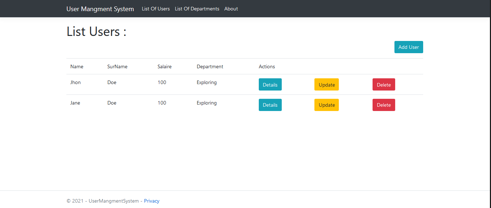
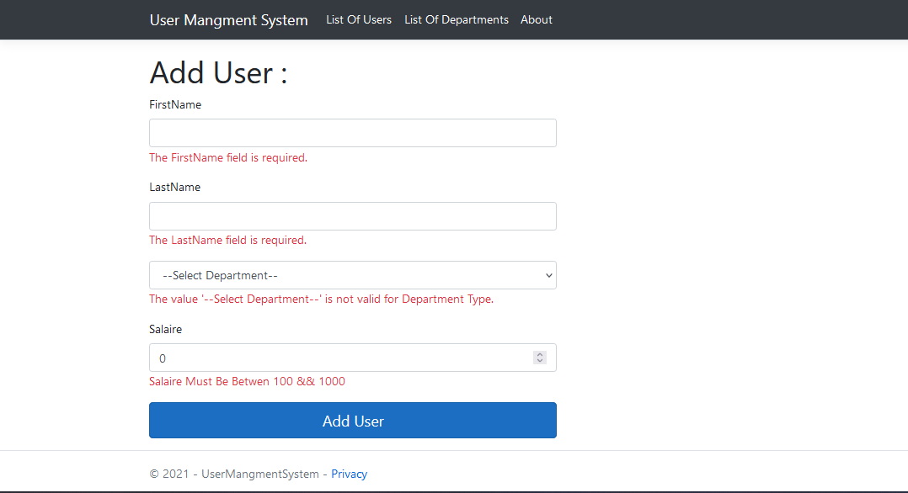

# A Crud App For Managing Employees And Departments C# / .net Core 5.0

---

---

## Description

- A .Net Core 5.00 App For Manging Employess And Departments

#### Fonctionnalites

- Crud Departments (Cascade )
- Crud Employess
- Validation

---

#### Technologies

- C# / .Net Core 5
- RAZOR
- Entity framework
- SQLServer
- Bootstrap4 / jQuery

---

#### To Run

- Change The Conx String appsettings.json
- Run Using .net Cli   `1 cd UserMangmentSystem `   `2 dotnet watch run `

#### Tools

- Visual Studio 2019
- SQLServer
